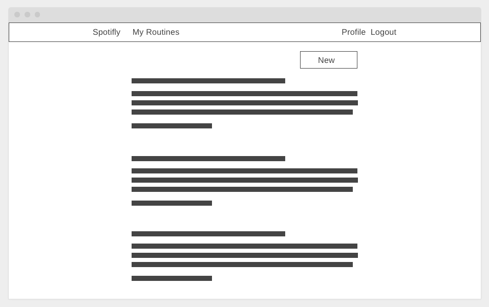
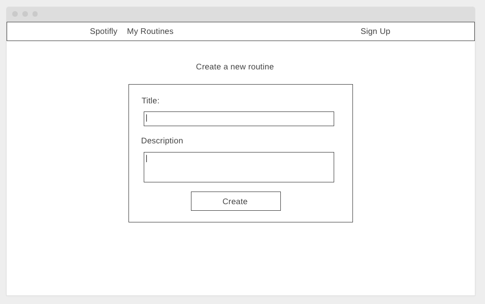
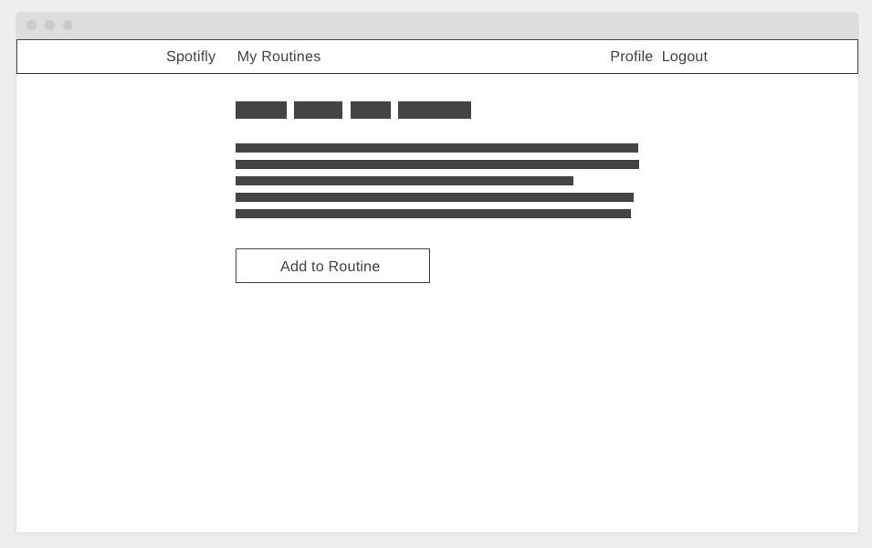
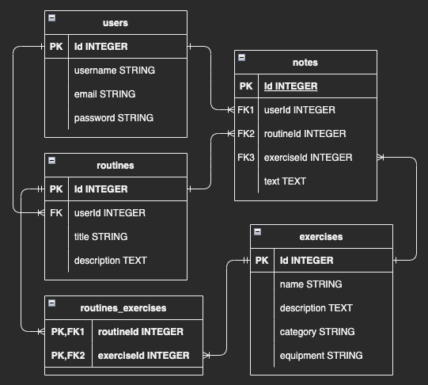
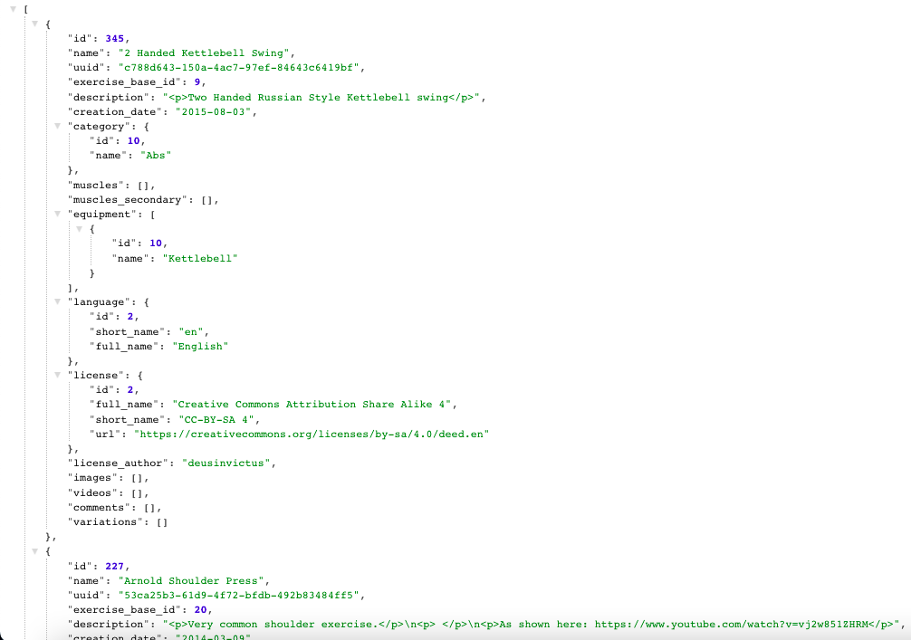

# Spotifly

"Can you spot me?" Get used to asking that when you head to the gym with your new workout routines. Use Spotifly to create your own exercise "playlists" and share them with others.

[→ Access the web app here! ←](https://spotifly-jasonxchen.koyeb.app/)

## User Stories

* As a user, I want to create workout routines to share with others and to keep as reminders for myself.
* As a user, I want to add notes on the exercises in my routines to express my thoughts.
* As a user, I want to update or delete my routines and/or the exercises they contain as desired.
* As a user, I want to explore a list of routines made by other users that I can try out.
* As a user, I want to save routines from others that stand out to me.

## Wireframes

"/" route


"/users/:username" route


"/routines/new" route


"/exercises" route


"/exercises/:exerciseId" route


"/signup" route


## ERD



## RESTful Routes

| HTTP METHOD | URL              | CRUD    | Response                              |
| ----------- | ---------------- | ------- | ------------------------------------- |
| GET | `/users/:username` | READ | render user details page with all their routines |
| GET | `/signup` | READ | render form for user creation |
| GET | `/login` | READ | render form for user login |
| GET | `/settings` | READ | render form to edit user settings |
| GET | `/logout` | N/A | log out user |
| POST        | `/users`         | CREATE  | create new user in database           |
| POST | `/users/login` | N/A  | log a user in with provided payload of information |
| PUT         | `/users/:userId` | UPDATE  | update user in database               |
| DELETE      | `/users/:userId` | DESTORY | delete user from database             |
| GET         | `/` | READ    | render all routines     |
| GET         | `/routines/:routineId` | READ    | render routine details page     |
| GET | `/routines/new` | READ | render form for routine creation |
| GET | `/routines/edit/:routineId` | READ | render form to edit routine |
| POST | `/routines` | CREATE | create new routine in database |
| PUT | `/routines/:routineId` | UPDATE | update routine in database |
| DELETE | `/routines/:routineId` | DESTORY | delete routine from database |
| DELETE | `/routines/:routineId/exercises/:exerciseId` | N/A | remove association of an exercise to routine |
| GET         | `/exercises` | READ   | render exercises from search result |
| *GET         | `/exercises/:exerciseId` | READ    | render exercise details page  |
| POST | `/exercises` | CREATE | create new exercise in db using API data |
| PUT | `/notes/:noteId` | UPDATE | update note in database |
*=stretch goal

## API

* [wger Workout Manager REST API](https://wger.de/api/v2/)
* No API key required to access public endpoints
* Example axios request:
```
const express = require("express");
const axios = require("axios");
const app = express();
const PORT = 3000;
app.get("/", async (req, res) => {
    try {
        // increase results limit to max of 50,000
        const response = await axios.get("https://wger.de/api/v2/exerciseinfo/?limit=50000");
        // explicitly filter by english language since API filter method is broken for now
        const filtered = response.data.results.filter(item => item.language.id === 2);
        res.json(filtered);    // send json data
    } 
    catch (error) {
        console.log(error);
        res.send("error");
    }
})
app.listen(PORT, () => {
    console.log(`api-test express server running on port ${PORT}`);
})
```
* .json results:<br>



## Tech Stack

* JavaScript
* Node.js
* PostgreSQL
* Tailwind CSS
* HTML5 (EJS)
* Sequelize
* Express

## Technology Usage

Thanks to Node.js this web application runs off an Express.js server with a PostgreSQL database system. The HTTP requests Express recieves goes through logic written in JavaScript and interacts with the database via Sequelize. Depending on the request, certain views are shown to the user with the help of  EJS rendering coupled with styling from Tailwind CSS element classes.

## Development Environment Installation Instructions

* Fork and clone this repository
* Run `npm install` to install dependencies
* Run `sequelize db:create` to create the development database
* Run `sequelize db:migrate` to migrate the models into the database
* Ensure nodemon is installed globally
    * If not, run `npm install -g nodemon` (or `npm install --save-dev nodemon` for local installation)
* Run `nodemon` to start the application (or `npx nodemon` for local installations)

## Minimum Viable Product (MVP) Goals

* [x] Create Routine and Exercise models w/ attributes
* [x] Associate 1:M and M:M relationships for User and Routine models, and Routine and Exercise models respectively
* [x] Render users, routines, and exercises GET routes
* [x] Implement POST, PUT, and DELETE routes for users and routines
* [x] "Add to routine" functionality for exercises from wger's Workout Manager REST API
* [x] Working user authentication and authorization
* [x] Incorrect login management
* [x] Password information is securely handled
* [x] Encrypt necessary cookies
* [x] Minimal CSS styling

## Stretch Goals

* [x] Search for exercises from API results
* [x] Allow pagination of exercises on exercises/index.ejs view to cut down on API request time
* [x] Add About page and other links
* [x] Add option to edit notes on each exercise in routine
* [ ] Save other users' routines to your own (make a copy)
* [ ] Implement more search categories (e.g. by routine titles)
* [ ] Use modals instead of /new and /edit pages
* [ ] Incorporate Spotify API to add a music playlist to routines (1:M)
* [ ] Add a M:M relationship for Routine and a new Tag model for better organization
* [ ] Have template error page for error catches instead of res.send()
* [ ] Replace "Error 405" res.send() messages with something more standard (see google.com)
* [ ] Dark mode
* [ ] Dynamic search
* [ ] Hash/encrypt IDs in URL
* [ ] A nice logo referencing wings for the latissimus dorsi muscle
* [ ] Update README.md Wireframes, ERD, and Routes as projects evolves

## Approach Taken

Once I had my database relationships drawn out on my ERD, I realized I needed to *start on my most nested data first*. Before I could do anything with users or routines, I needed the exercise data to interact with. I started out by mapping over what I could pull from wger's API into my local database. Once that was accomplished, I manually created some routines and implemented ways to relate certain exercise records to routine records. After that, I manually created some users and added ways to tie routines with exercises to the users based on the relationships defined on the ERD. Once I was able to get that working as well, the next step was to allow a new visitor to the site to first create a user account, then add routines to the account, and finally add exercises to the routines. For a full user experience, I also added full CRUD to the users and routines models. During these implementations, proper maintenance of the database had to be considered at all times, especially making sure deletion of records cascaded properly.

## Post-Project Sprint Reflections

There were no unsolved problems on deployment of MVP, but I generally feel like there were too many stretch goal features that I wanted to include and not enough time to implement them all. Major hurdles I'd like to reflect back on though were picking up a new CSS framework and using Sequelize's "onDelete: cascade" on join tables. I was considering dropping Tailwind CSS in the middle of learning it in favor of a UI kit to save time. In the end, I stuck with Tailwind and it's documentation page stuck with me. On my browser tabs. For the rest of the project. Anyways, I'm glad to have learned a CSS framework that gives me more control and will be helpful in my future endeavors. The other point of stagnation was due to Sequelize's "onDelete: cascade" not behaving like I expected or wanted in scenarios related to join tables. After a few hours of searching and experimentation, I fell back to a less efficient way of manually cleaning up references to deleted records. What I learned about myself is that, while I feel like my project development is slower than I'd like, I'm proud of how I utilize that time to ensure each new feature is as robust and refined as I can make them.

## Sources

* Image assets from freepik.com
